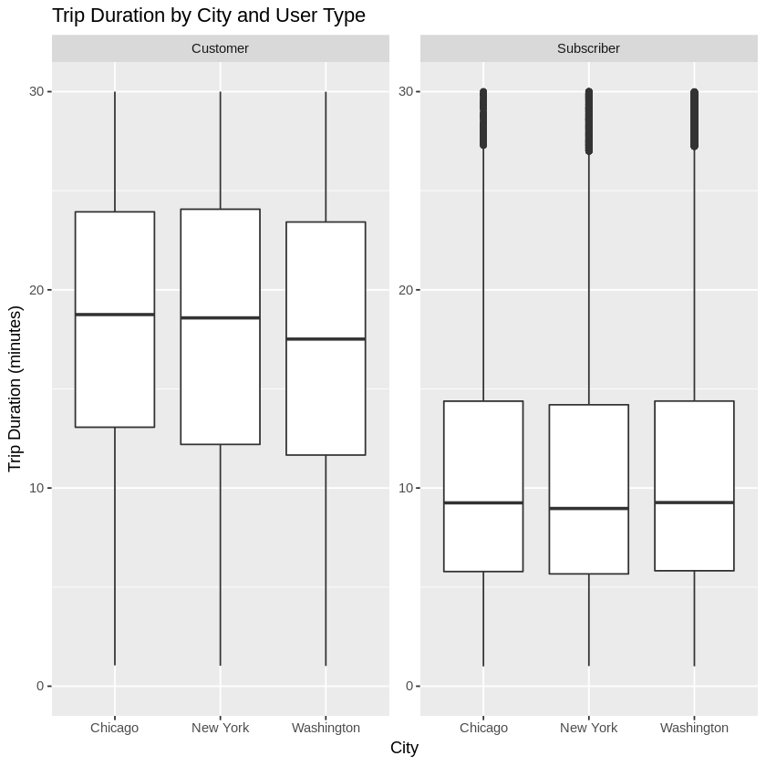
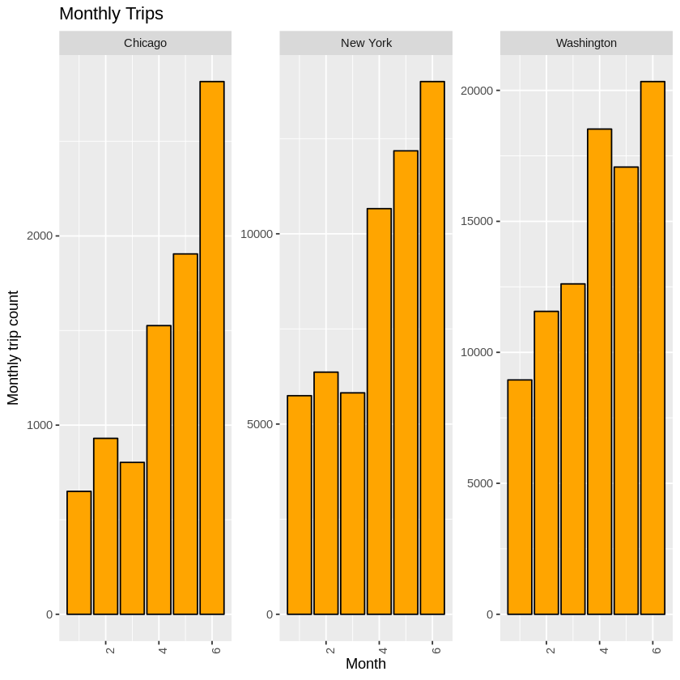
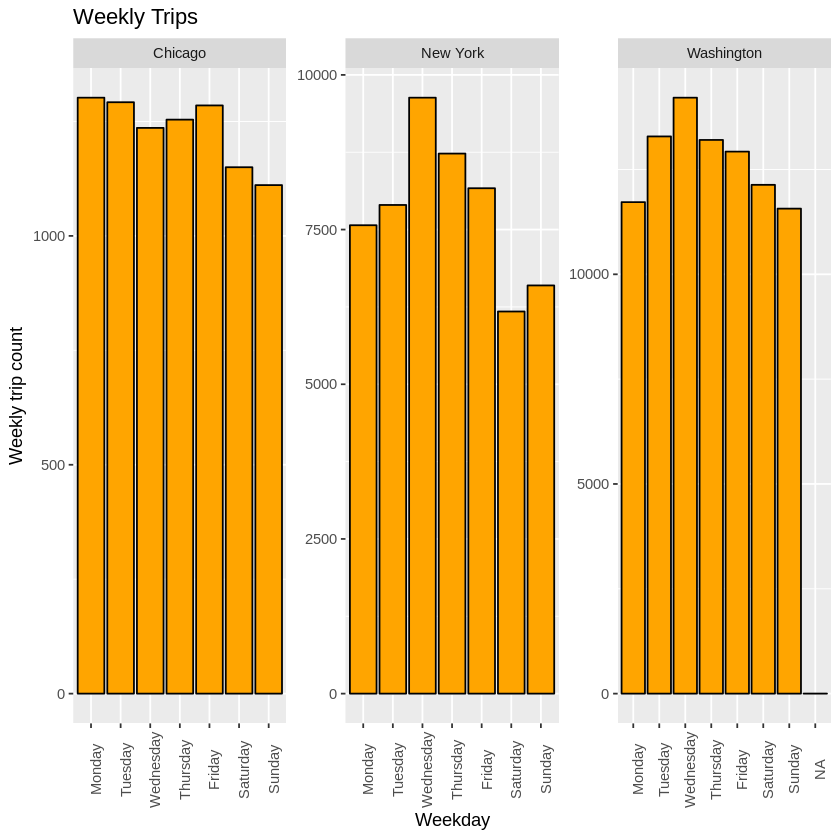
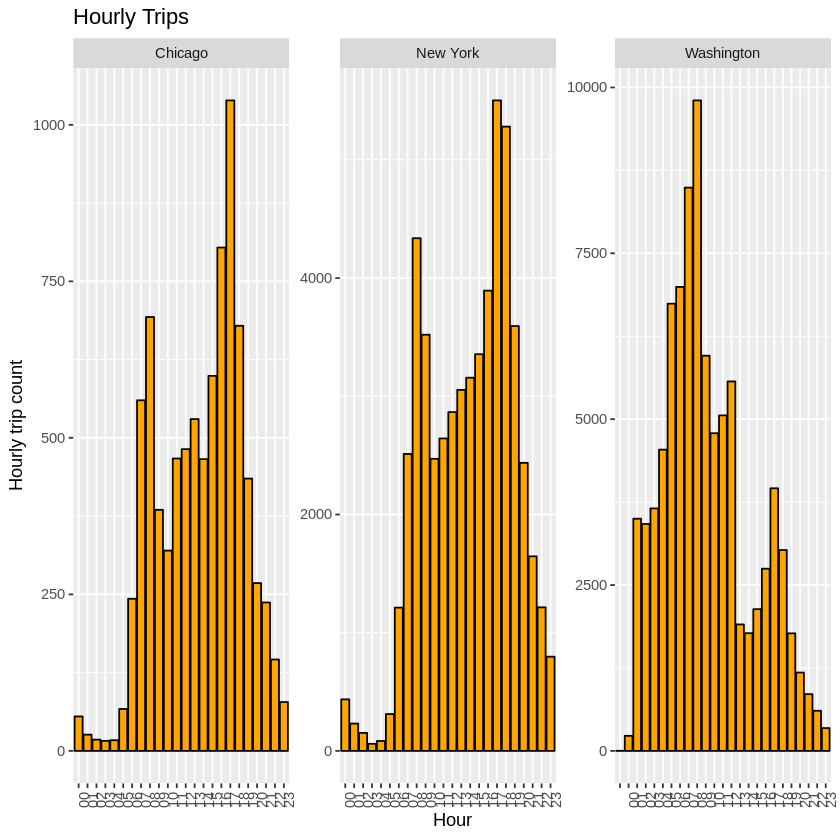
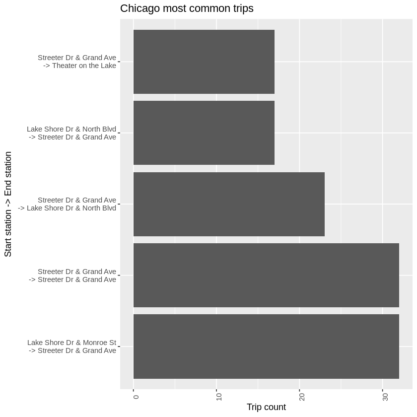
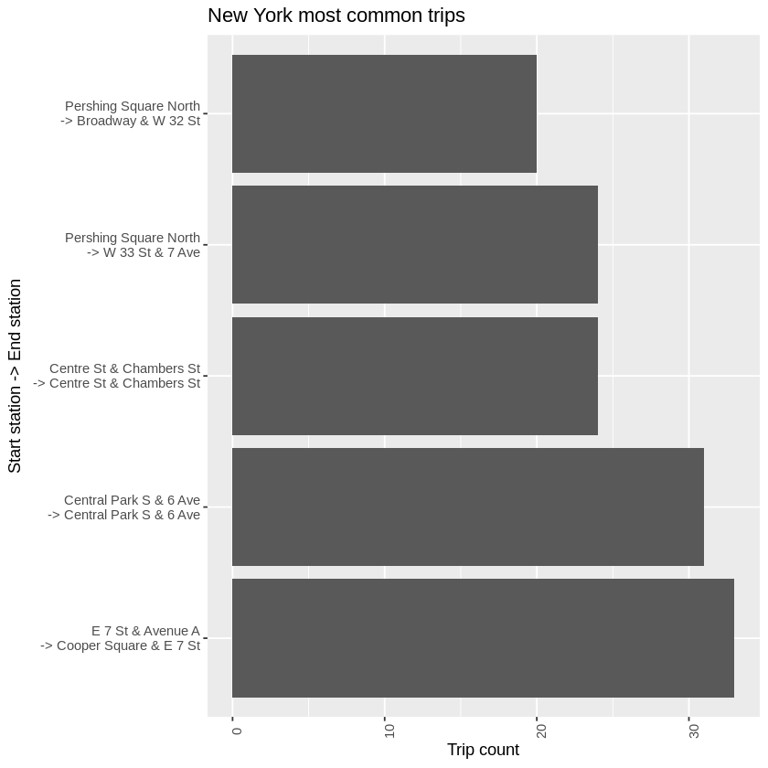
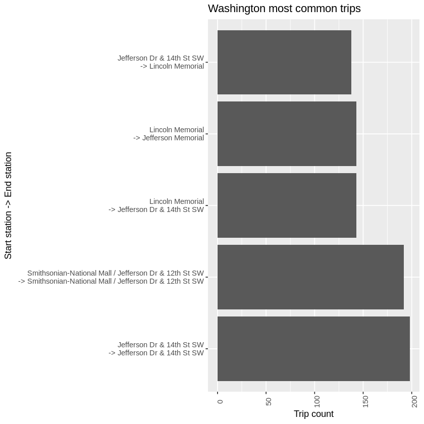

## Explore Bikeshare Data

### Description

This project was made within the Udacity Nanodegree "Programming for Data Science with R". The goal of the project is to do an Exploratory Data Analisys (EDA) of a real dataset collected at a Bikeshare service operating in three cities (Chicago, New York, Washington). To explore interesting insights in the data three set of questions were stated. The investigation to answer these question was supported by charts and graphs generated with R programming language. You can explore the Jupyter notebook, and see a summary of the results below.

### Question 1: Trip duration

- What is the total travel time for users in different cities?
- What is the average travel time for users in different cities?
- What is the travel time for different user types?

**Question 1 chart**

**Summary question 1 results**

I have first explored the data on trips duration by the summary table. The big spread in trip times led me to explore the dependence to user type.

Contrary to what I first thought, occasional customers have longer trip times than subscribers. This probably indicates subscribers using the service frequently for their daily commute, while one-time customers tend to use it on longer leisure trips.

### Question 2: Popular times of travel (i.e., occurs most often in the start time)

- What is the most common month?
- What is the most common day of week?
- What is the most common hour of day?

**Question 2 charts**

**Summary question 2 results**

Popular times of travel where explored. First the summary tables shown the number of trips made for each month, weekday, and hour of the day. The most relevant features like a reduction of trips on weekend or at night hour is observable from the tables.

However, the graphs convey more clearly the data and the comparison between cities can be more clearly made.

On monthly trip, we can observe a steady increase on use from January to June, being June the most used month in our three cities. An explanation to these data would be an existing bikeshare service that is more used in the spring months than on winter. It is interesting to note that the difference between use in winter and spring months is stronger in Chicago and New York than in Washington. This makes sense being the winter climate harsher in Chicago and New York than in Washington.

On weekly trip, we see a lower use of the service on weekends, specially at Chicago and New York. This indicates that the service is quite used for work commutes in these cities. At Washington the service is lower on the weekends, but still at the level of Monday use. This may again be related to a milder climate and higher use of the service for pleasure.

Hourly trips data reveal two peak hours at the morning and at the evening. This corresponds to work entry and leave times. Again, Chicago and New York are similar in that the evening peak time is bigger than the morning peak time, while in Washington is the other way around. This may be relate to a higher proportion of jobs being on the public sector in Washington.

### Question 3: Popular stations and trips

- What is the most common trip from start to end (i.e., most frequent combination of start station and end station)?

**Question 3 charts**

**Summary of question 3 results.**

Tables of the most common trip as combination between start station and end station were created using the `paste` function to concatenate strings, and the `table` fuction to count each occurrence. The top 5 most common trips were filtered and plotted in a bar graph.

The central stations are predictably well represented in the most common trips and, frequently, the same popular station is both the start and end station of the trip. 

